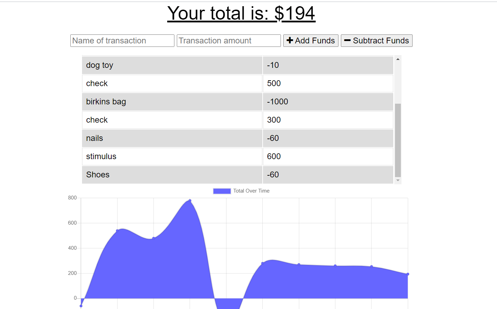

# Budget-Tracker
## Description
  ---
  This project focused on the use of service worker and utilizing it to save files to the cache so it becomes available the next time it loads. This application allows for the user to add expenses and deposits to their budget with or without a connection. When entering transactions offline, they should populate the total when brought back online.

  ## Table of Contents 
  --- 
  [Application](#application)
  
  [Usage](#usage)
  
  [Contributing](#contributing)

  [Tests](#test)

  [Questions](#questions)

  [Link](#deployedLink)
  
  ## Application
  ---
  
  ## Usage
  ---
  * Add the name of the expense or deposit inside the *Name of transaction* input field
  * Add the amount in the *Transaction Amount* input field
  * Specify whether to add or subtract funds using the add or subtract funds buttons
  * View past transactions from the chart view or the graph view below the input

  ## Contributing
  ---
  * Lorena Ramirez
  * UNC Charlotte Coding Bootcamp

  ## Test
  ---
  Toggle between on and offline line through by turning off wifi or selecting in chrome bev tools to test transactions are working and saving properly

  ## Questions
  ---
  To reach me with additional questions please contact me with one of the following below.
  * My github profile - [Github Link](https://github.com/Lorena-Ramirez)
  * Email - <ramirezlorenaa18@gmail.com>

 ## Link
  ---
  [Deployed Site](https://ancient-retreat-70076.herokuapp.com/)

  